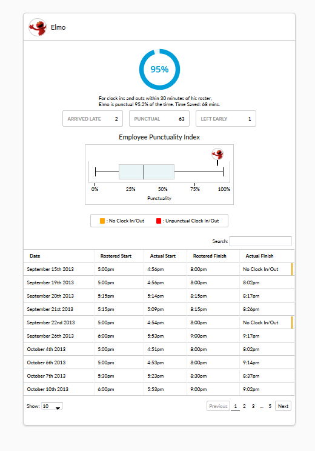

# Tanda Code Challenges - Punctuality

Hi!
Welcome to my solution to the coding challenge 'Punctuality' presented by [TandaHQ](https://github.com/TandaHQ/work-samples).

I decided to complete the challenge ‘Punctuality’ which is an per-employee summary of shift punctuality. I chose this challenge because it appealed to me and my technical prowess. I was also intesrested in 'Browser Rosters' and 'Pings' but I felt this was a nice mixture between front-end and back-end design/engineering and therefore would showcase my abilities.

### How to view my solution
The solution is built from HTML, CSS, JS and contained within a Node Project:
1. You will need to be running the server to supply the data. This can be found in /task and instructions to run the server at /task/readme.md
1. Open /solution/index.html in your favourite browser! The solution has been tested in Chrome and Firefox, though should display fine in other browsers.
  *	Or, if you are feeling extra technical and have Node installed, you can launch the solution through browsersync with “cd  /solution/ gulp”. (See gulp.js for required dependencies)

### Tasks Completed
From the task list provided, I completed the following:

#### Basic features:
* Display rostered times for specific dates
* Display if corresponding actual time was on time, or if there was an issue with it
* Hover over actual time comment to see what the actual time was

#### Advanced features:
* Pagination ("Show [25] shifts" / "Showing 1 to 5 of 5 shifts") (Handled by [Jquery Dynatable](https://github.com/alfajango/jquery-dynatable). ) re-wrote a lot the css to match the Tanda style. )
* Handling of shifts/rosters with some times missing (just indicate that in the UI, "no finish time clocked")
* Summary of times, through textual summary ("Mike is punctual 80% of the time"), chart, and summary of results ("punctual: 8, left early: 2")

#### New features:
* Redesign data table with colour bar prompts
* Table legend
* Employee Punctuality Index

### Rational
In this section, I will explain the reasoning behind my design choices and new added features.
#### Data table redesign:
The original table showed rostered times and then whether the employee was ‘on time’ or not with the minutes difference displayed in the cell. The user then had to hover over the cell to get the actual clock in/out time that was late. I found this to be counter intuitive. Having to hover to get information is annoying and typically tooltips are only used for tips or prompting the user; not conveying data. Additionally, it isn’t obvious to the user that hovering will give the clock in/out time. To my understanding, strings (on time, late, early) were used in the cell so that the viewer can quickly distinguish between the three values. Dumping every time would indeed be difficult to read.

I decided to display both roster and shift times as the time value removing the need to hover. In order to combat the readability issue, colour bars, in conjunction with a legend were used in cells that require specific attention. Reading through the table, the colour bars are immediately obvious and quickly convey and issue with this cell. We are able to interpret colours much faster than having to read a line for meaning. If no colour is present then there is no issue with the cell. Red (Bad, critical) and orange(warning, of concern) were used due to their innate, cultural meanings.

#### Employee Punctuality Index (EPI):
Comparison feature between all employees aimed to give quick insight through a box plot with the currently viewed employee’s ranked, overlayed. Quick explain of box plot. Ranges, quartiles.
For demonstration purposes,  the box plot’s values are randomly generated with the ranges being set to 0 and 100 percent. Only real value is the current employee ranking.
This comparison may already be a feature in another module but having it displayed inside a specific employees summary is convenient. The information is simple, yet effective at giving context to an employee’s punctuality compared against the entire workplace.  

### Improvements
~~If I was to revisit this project, I would add a ‘reveal more’ button and have the data table hidden. Displaying the entirety of the data may be overwhelming to some, especially non-technical users. The most important information is at the top and presented through a visual and textual summary. The module would function and still convey critical information about employees without the data table present which leads to my reasoning as the table being an accessory to the module. If the users desires, the table can be un-collapsed for further context.~~
Added!

I would also add the date picker and write the pagination logic myself. The current situation didn’t permit me the time to finish these two features.

### How to Impliment Pagnation
1. Build HTML for "rows displayed" dropdown (`<input>`) and pages area (`<ul>` in a row).
2. Set intervals for rows displayed – 10,20,30 ect
3. Get pages based on shown rows / total rows
- add event for shown rows change to recalculate pages and update the table
- store current page var and set to 1 as defult
4. Bind ‘repagnate’ function to table to handle what rows are shown. Use hide and slice to achieve this. Something like `$table.find('tbody tr').hide().slice(currentPage * numPerPage, (currentPage + 1) * numPerPage).show();`
5. Generate page buttons. Loop page count and insert `<li>`
6. Bind event to page buttons and call repaginate on click with new current page var

### The Solution

